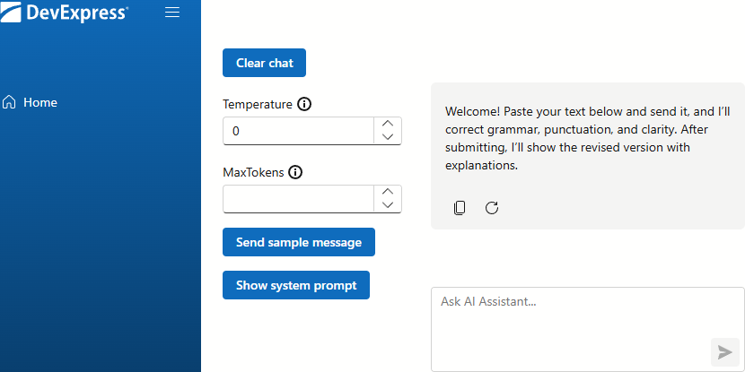

<!-- default badges list -->
[](https://supportcenter.devexpress.com/ticket/details/T1309846)
[](https://docs.devexpress.com/GeneralInformation/403183)
[](#does-this-example-address-your-development-requirementsobjectives)
<!-- default badges end -->
# DevExpress Blazor AI Chat — Grammar & Style Assistant

The [DevExpress AI Chat](https://docs.devexpress.com/Blazor/DevExpress.AIIntegration.Blazor.Chat.DxAIChat) component is a versatile foundation for building AI-driven applications. This example uses [OpenAI services](https://openai.com/index/chatgpt/) to create a customizable grammar checker and demonstrates how to:

- Use inference parameters to control AI model behavior and creativity.
- Limit token usage for a single call to manage costs and performance.
- Sanitize user prompts and model outputs to secure your app.
- Define system prompts that give the AI clear instructions on what to do.
- Request AI answers in Markdown and display them as HTML.
- Programmatically clear the chat and reset the context.
- Programmatically send messages to the chat.



## Setup and Configuration

To run this example, configure the project dependencies and set up secure authentication for an AI service.

### AI Packages

We use the following versions of Microsoft AI packages in the project:

- [Microsoft.Extensions.AI](https://www.nuget.org/packages/Microsoft.Extensions.AI) | **9.7.1**
- [Microsoft.Extensions.AI.OpenAI](https://www.nuget.org/packages/Microsoft.Extensions.AI.OpenAI) | **9.7.1-preview.1.25365.4**

 We do not guarantee compatibility or correct operation with higher versions. Refer to the following announcement for additional information: [DevExpress.AIIntegration moves to a stable version](https://supportcenter.devexpress.com/ticket/details/t1292705/devexpress-aiintegration-references-stable-versions-of-microsoft-ai-packages).

### Register AI Service

> [!NOTE]  
> DevExpress AI-powered extensions follow the "bring your own key" principle. DevExpress does not offer a REST API and does not ship any built-in LLMs/SLMs. You need an active Azure/Open AI subscription to obtain the REST API endpoint, key, and model deployment name. These variables must be specified at application startup to register AI clients and enable DevExpress AI-powered Extensions in your application.

This example uses the [OpenAI](https://openai.com/) service. For security, do not hardcode credentials in your source code. Instead, store your OpenAI API key in the `OPENAI_KEY` environment variable.

The following code in [Program.cs](CS/Program.cs) retrieves the API key. Modify this code if you prefer to keep keys in _appsettings.json_ or User Secrets.

```csharp
string OpenAIKey = Environment.GetEnvironmentVariable("OPENAI_KEY");
```

> [!IMPORTANT]
> If your application throws an `InvalidOperationException` exception, restart your IDE or terminal to ensure they load the new variable.

## Implementation Details

This section introduces the key code blocks used in the example and how they work together to deliver a complete AI chat experience.

### Inference Parameters

Inference parameters are runtime settings that control how a model generates an output. You can use them to change creativity, length, or randomness of a response without retraining the model.

This example allows the user to control model [temperature](https://docs.devexpress.com/Blazor/DevExpress.AIIntegration.Blazor.Chat.DxAIChat.Temperature).

```razor
<DxSpinEdit @bind-Value="@Temperature" MinValue="0" MaxValue="2" Increment="0.05f" />

<!-- ... -->

<DxAIChat Temperature="@Temperature"
          MessageSent="@MessageSent">
</DxAIChat>

@code {
    float? Temperature { get; set; } = 0;

    async Task MessageSent(MessageSentEventArgs args) {
        /* ... */
        var chatOptions = new ChatOptions {
            Temperature = Temperature
        };
        var response = ChatClient.GetStreamingResponseAsync(messages, chatOptions);
        /* ... */
    }
}
```

### Token Usage

A [token](https://platform.openai.com/tokenizer) is a basic unit of text that an AI model reads/writes. A token can be a whole word, part of a word, or a punctuation mark.

OpenAI [bills](https://openai.com/api/pricing/) you for the total token count. To save money, [set](https://docs.devexpress.com/Blazor/DevExpress.AIIntegration.Blazor.Chat.DxAIChat.MaxTokens) a maximum number of tokens. A token limit also helps you stay within the model's context window, which ensures the AI retains earlier parts of the conversation.

```razor
<DxSpinEdit @bind-Value="@MaxTokens" MinValue="0" Increment="10" />

<!-- ... -->

<DxAIChat MessageSent="@MessageSent">
</DxAIChat>

@code {
    int? MaxTokens { get; set; } = null;

    async Task MessageSent(MessageSentEventArgs args) {
        /* ... */
        var chatOptions = new ChatOptions {
            MaxOutputTokens = MaxTokens
        };
        var response = ChatClient.GetStreamingResponseAsync(messages, chatOptions);
        /* ... */
    }

}
```

### Input Sanitization

To maintain data privacy, remove Personally Identifiable Information (PII) from your prompts. This practice ensures that sensitive details, such as email addresses or credit card numbers, do not reach external servers.

Handle the [MessageSent](https://docs.devexpress.com/Blazor/DevExpress.AIIntegration.Blazor.Chat.DxAIChat.MessageSent) event to override the automatic message delivery and preprocess the messages before they are sent to OpenAI. 

```razor
<DxAIChat MessageSent="@MessageSent">
</DxAIChat>

@code {
    string ProcessText(string input) {
        string placeholder = "[email removed]";
        string emailPattern = @"[a-zA-Z0-9._%+-]+@[a-zA-Z0-9.-]+\.[a-zA-Z]{2,}";
        return Regex.Replace(input, emailPattern, placeholder);
    }

    async Task MessageSent(MessageSentEventArgs args) {
        var blazorMessages = args.Chat.SaveMessages();
        var messages = blazorMessages.Select(m => new ChatMessage(
            GetChatRole(m.Role),
            ProcessText(m.Content))).ToList();
        /* ... */
        await args.Chat.SendMessage(responseString, ChatRole.Assistant);
    }
}
```

After the message is processed, call [SendMessage](https://docs.devexpress.com/Blazor/DevExpress.AIIntegration.Blazor.Chat.IAIChat.SendMessage(String--ChatRole--List-AIChatUploadFileInfo-)) in the event handler.

### AI Instructions

System prompts define instructions and boundaries for the AI, which restrict the model's focus to a specific role. This prevents the model from "chatting" with the user.

This example establishes the AI as a proofreader with expert English skills. This specific identity ensures that the model fixes all grammar and punctuation errors and enhance the clarity and flow of the sentences.

```text
You are a proofreader with excellent English skills. Your tasks:
- **Correct** grammar and punctuation
- **Improve** clarity and sentence structure
- **Be polite** and constructive

When a user sends text:
- Rewrite it with improvements
- Afterward, explain your changes with:
    - The original phrase
    - The updated version
    - A brief explanation of why it was modified
```

This system prompt initializes at the start of each session and persists after a chat reset.

```csharp
string SystemPrompt { get; set; }

protected override void OnInitialized() {
    base.OnInitialized();
    using(var sr = new StreamReader("prompt.txt")) {
        SystemPrompt = sr.ReadToEnd();
    }
}

void ResetChat() {
    List<BlazorChatMessage> initialMessages = new(){
        new BlazorChatMessage(Microsoft.Extensions.AI.ChatRole.System, SystemPrompt),
        new BlazorChatMessage(Microsoft.Extensions.AI.ChatRole.Assistant, "Welcome! Paste your text below and send it..."),
    };
    RefAiChat.LoadMessages(initialMessages);
}

protected override void OnAfterRender(bool firstRender) {
    if(firstRender)
        ResetChat();
}
```

### Format AI Response

Set the [ResponseContentFormat](https://docs.devexpress.com/Blazor/DevExpress.AIIntegration.Blazor.Chat.DxAIChat.ResponseContentFormat) property to Markdown to request rich-formatted responses from the AI model. You can then use a markdown processor to convert this content to HTML and display it using the [MessageContentTemplate](https://docs.devexpress.com/Blazor/DevExpress.AIIntegration.Blazor.Chat.DxAIChat.MessageContentTemplate) property.

```Razor
@using Markdig
@using Ganss.Xss

<DxAIChat ResponseContentFormat="ResponseContentFormat.Markdown">
    <MessageContentTemplate>
        <div class="demo-chat-content">
            @ToHtml(context.Content)
        </div>
    </MessageContentTemplate>
</DxAIChat>

@code {
    private readonly HtmlSanitizer sanitizer = new HtmlSanitizer();

    MarkupString ToHtml(string markdown) {
        string html = Markdown.ToHtml(markdown);
        html = sanitizer.Sanitize(html);
        return new MarkupString(html);
    }
}
```

> [!IMPORTANT]
> Always sanitize HTML generated from Markdown to prevent cross-site scripting (XSS). Use a trusted sanitizer (for example, the [HtmlSanitizer](https://www.nuget.org/packages/HtmlSanitizer/) package) to allow only safe tags and attributes before the browser renders content.

### Programmatically Handle Messages

Use the [SendMessage](https://docs.devexpress.com/Blazor/DevExpress.AIIntegration.Blazor.Chat.DxAIChat.SendMessage(String--ChatRole--List-AIChatUploadFileInfo-)) method to programmatically send a message to the chat:

```csharp
void SendSampleMessage() {
    RefAiChat.SendMessage("open code of this example and change OpenAI...",
        ChatRole.User);
}
```

## Files to Review

- [Program.cs](CS/Program.cs)
- [Index.razor](CS/Components/Pages/Index.razor)
- [prompt.txt](CS/prompt.txt)

## Documentation

- [DxAIChat](https://docs.devexpress.com/Blazor/DevExpress.AIIntegration.Blazor.Chat.DxAIChat)
- [MaxTokens](https://docs.devexpress.com/Blazor/DevExpress.AIIntegration.Blazor.Chat.DxAIChat.MaxTokens)
- [Temperature](https://docs.devexpress.com/Blazor/DevExpress.AIIntegration.Blazor.Chat.DxAIChat.Temperature)
- [ResponseContentFormat](https://docs.devexpress.com/Blazor/DevExpress.AIIntegration.Blazor.Chat.DxAIChat.ResponseContentFormat)
- [MessageContentTemplate](https://docs.devexpress.com/Blazor/DevExpress.AIIntegration.Blazor.Chat.DxAIChat.MessageContentTemplate)
- [SendMessage](https://docs.devexpress.com/Blazor/DevExpress.AIIntegration.Blazor.Chat.DxAIChat.SendMessage(String--ChatRole--List-AIChatUploadFileInfo-))
- [LoadMessages](https://docs.devexpress.com/Blazor/DevExpress.AIIntegration.Blazor.Chat.DxAIChat.LoadMessages(System.Collections.Generic.IEnumerable-DevExpress.AIIntegration.Blazor.Chat.BlazorChatMessage-))
- [MessageSent](https://docs.devexpress.com/Blazor/DevExpress.AIIntegration.Blazor.Chat.DxAIChat.MessageSent)

<!-- feedback -->
## Does this example address your development requirements/objectives?

[](https://www.devexpress.com/support/examples/survey.xml?utm_source=github&utm_campaign=draft-blazor-ai-chat-showcase&~~~was_helpful=yes) [](https://www.devexpress.com/support/examples/survey.xml?utm_source=github&utm_campaign=draft-blazor-ai-chat-showcase&~~~was_helpful=no)

(you will be redirected to DevExpress.com to submit your response)
<!-- feedback end -->
